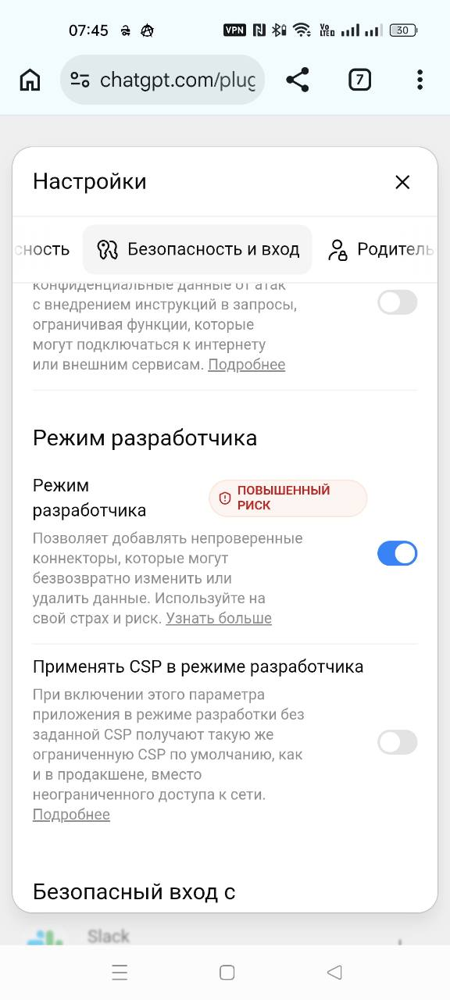
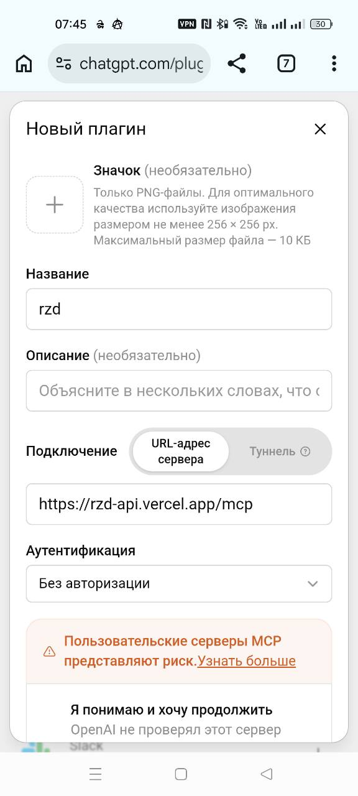
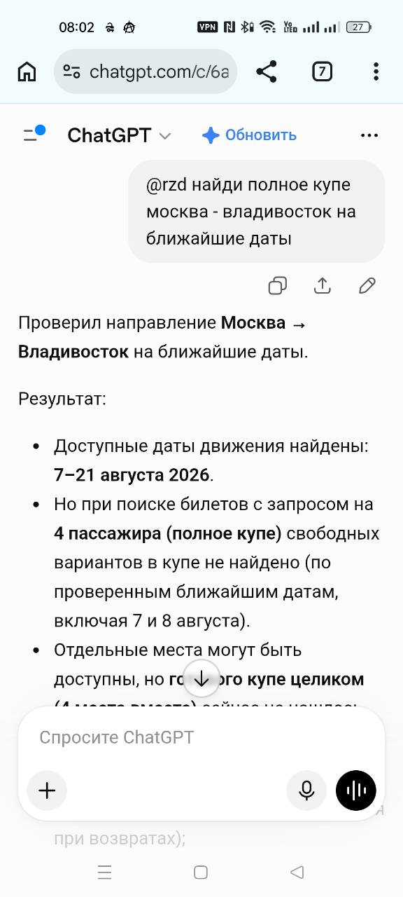
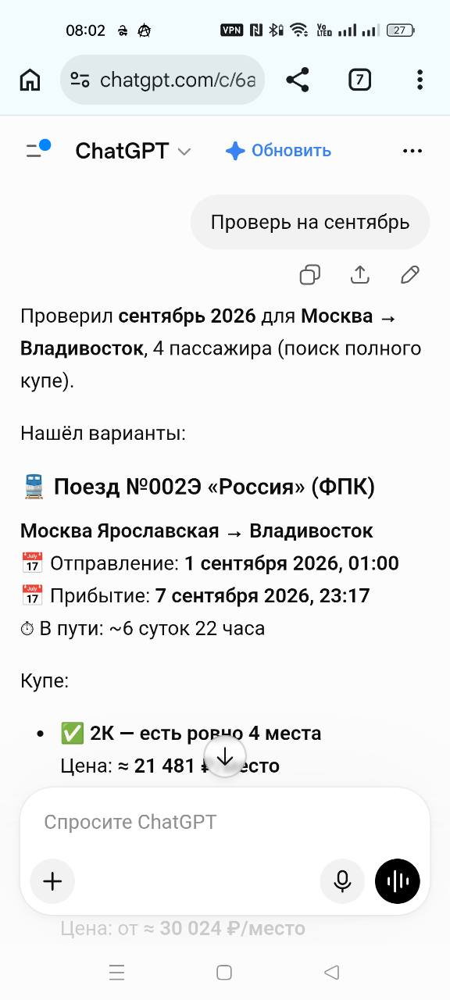

# Как научить ChatGPT искать целое купе: неофициальный API РЖД, Bun, MCP, Vercel и reverse proxy

> Дисклеймер: проект не связан с ОАО «РЖД». Он использует внутренние endpoint сайта `ticket.rzd.ru`, которые могут измениться или перестать работать без предупреждения. Доступность мест и цены меняются в реальном времени; перед покупкой всё необходимо перепроверить на официальном сайте или в приложении РЖД. Код выполняет только чтение данных и не покупает билеты.

Задача звучит просто: «Найди полное купе из Москвы во Владивосток на ближайшие даты». Но обычный поиск билетов отвечает на другой вопрос — какие поезда и места доступны на конкретную дату. Человеку всё равно приходится перебирать календарь, открывать поезда и вагоны и проверять, лежат ли четыре свободных места в одном купе.

Я решил вынести эту рутину в MCP-сервер, чтобы можно было спросить прямо в ChatGPT:

```text
@rzd найди полное купе Москва — Владивосток на ближайшие даты
```

В результате получился публичный проект [slavb18/rzd-api](https://github.com/slavb18/rzd-api): типизированный клиент неофициального API РЖД на Bun/TypeScript, локальный и удалённый MCP-сервер и entrypoint для Vercel. В этой статье разберём весь путь — от переноса Python-кода до проблемы с исходящими адресами Vercel и аккуратного reverse proxy.

## Что именно считать полным купе

Это важнее выбора фреймворка.

В ответе поискового endpoint может быть написано, что в купейных вагонах осталось четыре места. Но это ещё не означает, что все они находятся за одной дверью. Они могут быть разбросаны по четырём разным купе или даже по нескольким вагонам.

Поэтому есть два уровня ответа:

1. **Кандидат:** у поезда или класса обслуживания суммарно есть не менее четырёх мест.
2. **Подтверждённое полное купе:** в конкретном вагоне четыре свободных места относятся к одному физическому купе.

Надёжный алгоритм выглядит так:

```text
календарь движения
    ↓
поезда на каждую дату, adults = 4
    ↓
купейные группы с достаточным числом мест
    ↓
конкретные вагоны и FreePlaces
    ↓
схема вагона / группировка номеров по купе
    ↓
четыре свободных места в одной группе
```

Если последний шаг выполнить не удалось, ассистент должен честно написать «найден вагон минимум с четырьмя местами», а не «найдено целое купе». Это хороший пример того, почему LLM полезна как оркестратор, но правила проверки лучше держать в инструментах и коде.

## Архитектура

Итоговая схема получилась такой:

```text
ChatGPT
  │  MCP Streamable HTTP
  ▼
https://rzd-api.vercel.app/mcp
  │
  ├─ Elysia: /mcp и /health
  ├─ mcp-handler: протокол и сессии
  └─ Bun/TypeScript RzdClient
          │
          │ RZD_BASE_URL / RZD_B2B_BASE_URL
          ▼
  приватный reverse proxy
          │
          ▼
      ticket.rzd.ru
```

Адрес reverse proxy и его закрытые маршруты намеренно не опубликованы. В GitHub лежат только имена переменных окружения. Сам сервер MCP можно развернуть со своими upstream-адресами или использовать прямой API РЖД там, где он доступен.

## Что было в Python-версии

Исходный проект [drGOD/rzd-api](https://github.com/drGOD/rzd-api) был удобной отправной точкой: в нём уже были найдены нужные запросы к неофициальному API и реализован Python-клиент. Но для небольшого serverless-сервиса хотелось получить:

* один runtime для клиента и MCP;
* встроенный асинхронный `fetch`;
* строгие типы входов и ответов;
* быстрый локальный запуск через Bun;
* Streamable HTTP для ChatGPT и STDIO для локальных MCP-клиентов;
* прямой маршрут `/mcp` без промежуточных rewrites;
* минимальный web-слой.

Я создал новый каталог и новый проект через `bun init`, а не стал превращать Python-репозиторий в смешанный монорепозиторий.

```bash
mkdir rzd-api
cd rzd-api
bun init
bun add @modelcontextprotocol/sdk zod mcp-handler elysia
```

Изначально хотелось обойтись голым Bun. Для локального Streamable HTTP это действительно возможно через `Bun.serve`. Но для определения Vercel Function и явных корневых маршрутов небольшой слой Elysia оказался практичным. Hono не понадобился.

## Перенос клиента с Python на Bun

Перенос не был механической заменой `requests.get()` на `fetch()`. Я разделил код на четыре слоя:

* `transport.ts` — HTTP, таймауты, повторы и JSON;
* `api.ts` — конкретные endpoint и параметры РЖД;
* `client.ts` — валидация, разрешение названий станций в коды и публичные методы;
* `models.ts` — типизированные представления поездов, вагонов, станций и схем.

Публичный вызов выглядит компактно:

```ts
import { RzdClient } from "rzd-api";

const client = new RzdClient();

try {
  const routes = await client.searchTickets(
    "Москва",
    "Владивосток",
    "2026-09-01",
    { adults: 4, onlyWithSeats: true },
  );

  console.log(routes);
} finally {
  client.close();
}
```

Клиент сначала параллельно разрешает обе станции через suggestions endpoint, затем вызывает поиск поездов с кодами станций. Для Москвы это важно: пользователь вводит город естественным языком, а API ждёт Express-код.

Даты принимаются в `DD.MM.YYYY`, `YYYY-MM-DD` или ISO и сравниваются по московскому времени. Неоднозначное название станции, прошедшая дата и неожиданная схема ответа превращаются в отдельные ошибки, а не в пустой список «ничего не найдено».

В текущей версии есть восемь операций:

| Метод клиента | MCP-инструмент | Назначение |
|---|---|---|
| `findStations` | `find_stations` | найти станцию и её код |
| `searchTickets` | `search_tickets` | найти поезда на дату |
| `getTrainAvailability` | `get_train_availability` | получить календарь движения |
| `getMinimalPrices` | `get_minimal_prices` | получить минимальные цены по датам |
| `getCarriages` | `get_carriages` | получить вагоны и свободные места |
| `getCarScheme` | `get_car_scheme` | получить схему конкретного вагона |
| `getCarImages` | `get_car_images` | получить метаданные изображений вагона |
| `getRouteStations` | `get_route_stations` | получить остановки поезда |

У внутреннего API нет обещания стабильности. Поэтому парсер допускает несколько встречавшихся вариантов регистра полей, но не скрывает несовместимый ответ: если список поездов или вагонов имеет неизвестную форму, выбрасывается `RzdSchemaError`.

## MCP: превращаем методы в инструменты

MCP-сервер построен на TypeScript SDK. Для каждого метода задаётся Zod-схема, краткое описание и аннотации безопасности:

```ts
server.registerTool(
  "search_tickets",
  {
    description: "Search direct RZD routes by station name/code and departure date.",
    inputSchema: z.object({
      from_station: z.string(),
      to_station: z.string(),
      departure_date: z.string(),
      adults: z.number().int().min(1).default(1),
      only_with_seats: z.boolean().default(true),
    }),
    annotations: {
      readOnlyHint: true,
      destructiveHint: false,
      openWorldHint: true,
    },
  },
  async (args) => {
    // вызов RzdClient и возврат JSON
  },
);
```

Все инструменты read-only. Сервер не принимает паспортные данные, не логинится в аккаунт РЖД и не оформляет заказ. Именно поэтому для демонстрационного экземпляра была выбрана схема «без авторизации». Для приватных данных или любых write-операций так делать нельзя.

Локально доступны два транспорта:

```bash
# STDIO — например, для Codex или другого локального MCP-клиента
bun run mcp

# Streamable HTTP
bun run mcp:http
curl http://127.0.0.1:8000/health
```

Для локального STDIO конфигурация Codex выглядит так:

```bash
codex mcp add rzd -- bun run /absolute/path/to/rzd-api/src/mcp.ts
```

## Почему Vercel оказался не одним `vercel deploy`

Первый serverless-вариант жил по адресу `/api/mcp`. Затем появилась отдельная задача: сделать красивый endpoint просто `/mcp`, без rewrite и без лишнего слоя маршрутизации.

Корневое приложение Elysia получилось почти тривиальным:

```ts
import { Elysia } from "elysia";
import mcp from "./mcp.js";

const app = new Elysia()
  .all("/mcp", ({ request }) => mcp.fetch(request))
  .get("/health", () => ({
    status: "ok",
    service: "rzd-api",
    version: "4.0.0",
  }));

export default app;
```

В настройках проекта Vercel выбран Elysia, а `vercel.json` содержит только версию Bun:

```json
{
  "$schema": "https://openapi.vercel.sh/vercel.json",
  "bunVersion": "1.x"
}
```

То есть `/mcp` принадлежит самому приложению — rewrite с `/mcp` на `/api/mcp` нет.

Для протокольной части используется `mcp-handler`. Здесь встретилась характерная ESM-ловушка serverless-сборки: внутренние TypeScript-импорты без расширения работали локально, но собранная функция не всегда могла разрешить модуль. Явные импорты вида `./src/mcp-server.js` исправили расхождение между локальным Bun и Vercel bundle.

Проверять деплой удобно в два этапа:

```bash
curl https://rzd-api.vercel.app/health
```

Ожидаемый ответ:

```json
{"status":"ok","service":"rzd-api","version":"4.0.0"}
```

После этого нужно проверять не просто HTTP 200 у `/mcp`, а полноценный MCP handshake и `tools/list`. Обычный GET без корректных заголовков и JSON-RPC-сообщения не доказывает, что MCP работает.

## Когда healthcheck зелёный, а запрос к РЖД висит

Самая интересная проблема проявилась уже после успешного деплоя. `/health` отвечал мгновенно, ChatGPT видел инструменты, но поиск станции или поезда зависал. Прямой запрос к РЖД из функции Vercel доходил до таймаута примерно через сто секунд.

Диагностика по слоям быстро сузила причину:

1. Elysia отвечает — функция запускается.
2. MCP handshake и список инструментов работают — транспорт исправен.
3. `find_stations("Москва")` локально возвращает результат.
4. Тот же upstream-запрос из Vercel не завершается.
5. Значит, проблема находится между исходящей сетью Vercel и `ticket.rzd.ru`, а не в ChatGPT и не в MCP.

Вероятная причина — фильтрация или особое отношение API РЖД к части внешних облачных адресов. Точно установить внутреннюю политику РЖД извне нельзя, поэтому в статье это именно вывод по наблюдаемому поведению, а не официальное объяснение.

## Reverse proxy без секрета в GitHub

Решением стал маленький reverse proxy на частном сервере, из сети которого РЖД отвечает нормально. Его задача — только передать два семейства запросов:

* публичный `api/v1` для станций, календаря, поездов и схем;
* `apib2b/p` для вагонов и маршрута.

Самое важное правило: фактические адреса, включая закрытый префикс, не должны попадать ни в исходники, ни в README, ни в историю Git.

Клиент читает только две переменные:

```ts
export function configFromEnvironment(env = process.env) {
  return {
    ...(env.RZD_BASE_URL ? { baseUrl: env.RZD_BASE_URL } : {}),
    ...(env.RZD_B2B_BASE_URL
      ? { b2bBaseUrl: env.RZD_B2B_BASE_URL }
      : {}),
  };
}
```

На Vercel значения задаются как Sensitive Environment Variables:

```text
RZD_BASE_URL=https://<private-host>/<secret-prefix>/api/v1
RZD_B2B_BASE_URL=https://<private-host>/<secret-prefix>/apib2b/p
```

В репозитории остаются только имена переменных и безопасные значения по умолчанию. После изменения env нужен новый deployment: уже запущенная serverless-функция не получает значения задним числом.

Санитизированный фрагмент Nginx передаёт правильный `Host` и SNI upstream-серверу:

```nginx
location /<secret-prefix>/api/v1/ {
    proxy_pass https://ticket.rzd.ru/api/v1/;
    proxy_set_header Host ticket.rzd.ru;
    proxy_ssl_server_name on;
    proxy_ssl_name ticket.rzd.ru;
}

location /<secret-prefix>/apib2b/p/ {
    proxy_pass https://ticket.rzd.ru/apib2b/p/;
    proxy_set_header Host ticket.rzd.ru;
    proxy_ssl_server_name on;
    proxy_ssl_name ticket.rzd.ru;
}
```

Это не должен быть открытый универсальный proxy. На практике стоит ограничить методы и пути, включить rate limiting, не проксировать произвольный upstream, не писать query string с чувствительными данными в access log и регулярно менять закрытый префикс. Для серьёзного публичного сервиса лучше добавить аутентификацию и собственную политику допустимой нагрузки.

После настройки проверка станции «Москва» через публичный MCP стала завершаться примерно за 1,6 секунды. Это одновременно подтвердило всю цепочку: ChatGPT/Vercel → MCP → Bun-клиент → приватный proxy → API РЖД.

## Как добавить MCP в ChatGPT

Интерфейс и доступность developer mode зависят от тарифа и workspace и могут меняться. По актуальной документации OpenAI custom MCP apps подключаются в ChatGPT Web; для разных планов включение developer mode может требовать прав администратора. Официальная инструкция находится в статье [Developer mode and MCP apps in ChatGPT](https://help.openai.com/en/articles/12584461-developer-mode-and-full-mcp-connectors-in-chatgpt-beta).

В интерфейсе, в котором проводился тест, последовательность была такой:

1. Открыть настройки ChatGPT и включить **Режим разработчика**.
2. Перейти к приложениям/плагинам и выбрать создание нового.
3. Указать имя, например `rzd`.
4. Выбрать подключение по URL сервера.
5. Ввести `https://rzd-api.vercel.app/mcp`.
6. Для этого демонстрационного read-only сервера выбрать **Без авторизации**.
7. Запустить сканирование инструментов и подтвердить предупреждение о непроверенном сервере.
8. Открыть новый чат, выбрать приложение в меню инструментов или вызвать его через `@rzd`.





OpenAI отдельно предупреждает: custom MCP-серверы не проверяются автоматически, поэтому подключать следует только те, которым вы доверяете. Актуальные способы вызова приложений — выбор в меню инструментов или `@`-упоминание — описаны в обзоре [Apps in ChatGPT](https://help.openai.com/en/articles/11487775-connectors-in).

Не удивляйтесь, если названия пунктов на скриншотах и в вашем аккаунте различаются: OpenAI меняет терминологию с connectors/plugins на apps, а набор функций зависит от плана и этапа rollout.

## Как сформулировать запрос

Минимальный запрос:

```text
@rzd найди полное купе Москва — Владивосток на ближайшие даты
```

Но для воспроизводимого результата лучше задать критерии явно:

```text
@rzd Проверь Москва → Владивосток с 7 августа по 30 сентября 2026 года.
Нужны 4 взрослых пассажира и именно четыре места в одном физическом купе,
а не четыре места суммарно. Сначала получи календарь движения, затем проверь
поезда и конкретные вагоны. Если схема вагона не позволяет подтвердить одно
купе, пометь результат как неподтверждённый. Покажи поезд, даты, класс,
номера мест, цену за место и примерную сумму.
```

Такой prompt важен по двум причинам. Во-первых, он заставляет модель отличать агрегированное наличие от одного купе. Во-вторых, ограничивает число дорогих последовательных запросов понятным интервалом.

## Пример: на ближайшие даты полного купе нет

Во время тестовой сессии 6 августа 2026 года ChatGPT сначала получил календарь движения Москва → Владивосток, а затем проверил ближайшие даты с четырьмя взрослыми пассажирами. Ответ выглядел так:

> Проверил направление **Москва → Владивосток** на ближайшие даты.
>
> Доступные даты движения найдены: **7–21 августа 2026**. Но при поиске билетов с запросом на **4 пассажира** свободных вариантов полного купе по проверенным ближайшим датам, включая 7 и 8 августа, не найдено. Отдельные места могут быть доступны, но готового купе целиком сейчас не нашлось.



Правильный UX здесь — не останавливаться на «ничего нет», а предложить расширить диапазон, отслеживать возвраты или искать вариант 2+2 в одном вагоне.

## Пример: вариант на сентябрь

После запроса «Проверь на сентябрь» в той же сессии появился кандидат:

> **Поезд №002Э «Россия»**, Москва Ярославская → Владивосток. Отправление **1 сентября 2026, 01:00**, прибытие **7 сентября 2026, 23:17**, в пути около 6 суток 22 часов.
>
> * 2К — 4 места, около **21 481 ₽ за место**, примерно **86 000 ₽** за четыре;
> * 2Т — варианты от **24 885 ₽ за место**;
> * 2Ф — варианты от **30 024 ₽ за место**.
>
> Для поезда №010Н купейные места были, но полного набора из четырёх мест не было.



Этот фрагмент — снимок ответа ассистента, а не гарантия наличия. Цены округлены, места могли быть выкуплены сразу после запроса, а рекламные условия вроде скидки «Купек» требуют отдельной проверки на официальной странице акции.

Кроме того, формулировка «2К — есть ровно 4 места» сама по себе подтверждает только количество в полученной группе. Для публикации или автоматического уведомления я бы усилил итоговый вывод номерами вагона и мест после `get_carriages` и проверки схемы. Без этого корректнее называть поезд **кандидатом на полное купе**.

## Что получилось и что ещё улучшить

В итоге один вопрос на естественном языке запускает цепочку из нескольких read-only инструментов: находит коды станций, календарь движения, поезда, вагоны и схему. Bun обслуживает и библиотеку, и MCP; Vercel даёт стабильный публичный `/mcp`; приватный proxy решает сетевую несовместимость, не раскрывая свой адрес в Git.

Но это всё ещё инженерный прототип поверх неофициального API. Следующие полезные улучшения очевидны:

* вынести проверку «четыре места в одном купе» в отдельный MCP tool, чтобы она была детерминированной;
* добавить ограниченный параллелизм при переборе дат;
* кэшировать календарь и справочник станций, но не устаревающее наличие мест;
* возвращать краткий нормализованный результат вместо больших `raw`-ответов;
* добавить наблюдаемость по каждому upstream endpoint без логирования приватных URL;
* реализовать мониторинг возвратов с уведомлением, соблюдая разумную частоту запросов;
* для чужих пользователей защитить публичный endpoint аутентификацией и квотами.

Главный вывод проекта не в том, что LLM умеет искать билеты. Она умеет связать несколько специализированных операций и объяснить результат человеку. А качество ответа определяется тем, насколько строго инструменты различают «четыре доступных места» и «четыре места за одной дверью».

## Ссылки

* [Bun/TypeScript-клиент и MCP-сервер](https://github.com/slavb18/rzd-api)
* [Исходный Python-проект drGOD/rzd-api](https://github.com/drGOD/rzd-api)
* [Model Context Protocol](https://modelcontextprotocol.io/)
* [Developer mode and MCP apps in ChatGPT — OpenAI Help Center](https://help.openai.com/en/articles/12584461-developer-mode-and-full-mcp-connectors-in-chatgpt-beta)
* [Apps in ChatGPT — OpenAI Help Center](https://help.openai.com/en/articles/11487775-connectors-in)

